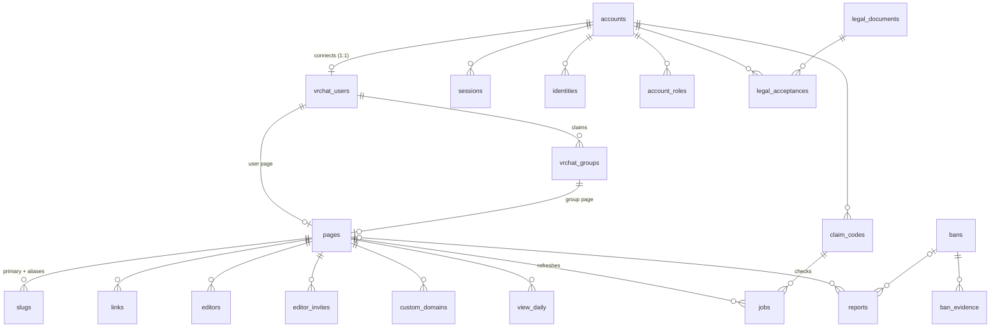

# vrc.page database

One Postgres database holds everything vrc.page stores. The SQL files in `db/migrations/` are the only source of truth, applied with dbmate. This document explains how the database is organised and the rules it enforces.

## Setting up

Everything runs against your existing Postgres server (version 15 or later; 18 preferred). Nothing here installs or runs Postgres.

### Two environments

| | Development | Production |
|---|---|---|
| Settings file | `.env.development` | `.env.production` |
| Database | `vrcpage_dev` | `vrcpage` |
| Logins | `vrcpage_dev_*` | `vrcpage_prod_*` |
| Commands | `npm run db:<command>` | `npm run db:<command>:prod` |

Each file is split into:
- the server: `DB_HOST`, `DB_PORT`, `DB_NAME`, `DB_SSL_MODE`,
- an admin login (`DB_ADMIN_*`, a superuser),
- a user and password for each login.

Every command prints which environment and database it is about to touch.

Both environments can live on the same server, and a development login still can't open the production database. Each database lets in only its own environment's logins; see [Roles](#roles).

### First time, per environment

1. Copy `.env.<environment>.example` to `.env.<environment>` and fill in the passwords. Use different passwords for production.
2. `npm install`
3. `npm run db:bootstrap` (or `db:bootstrap:prod`) creates the roles, this environment's logins and its database. It is safe to re-run, and resets the passwords when you do.
4. `npm run db:migrate` (or `db:migrate:prod`) applies the migrations, then creates the upcoming partitions.
5. `npm run db:test` runs `db/tests/invariants.sql` on development and rolls it back, so it leaves nothing behind.

### Everyday flow

Write a new migration and apply it to development with `db:migrate`. Undo it with `db:rollback` while you iterate. Run `db:test`. Only then run `db:migrate:prod`.

| Command | Development | Production | What it does |
|---|---|---|---|
| bootstrap | `db:bootstrap` | `db:bootstrap:prod` | Roles, logins, database |
| migrate | `db:migrate` | `db:migrate:prod` | Apply pending migrations and create partitions |
| status | `db:status` | `db:status:prod` | List applied and pending migrations |
| maintain | `db:maintain` | `db:maintain:prod` | Run the nightly maintenance once, by hand |
| rollback | `db:rollback` | refused | Undo the latest migration. In production it would drop tables with their data, so production only moves forward: write a new migration instead |
| test | `db:test` | refused | Invariant checks (rolled back) |

## Schemas

| Schema | Holds |
|---|---|
| `auth` | `accounts`, `sessions`, `identities`, `verifications` and `rate_limits` (the five Better Auth tables), plus `account_roles` and `notification_preferences` |
| `config` | `settings` (every tunable limit), `legal_documents`, `legal_acceptances` |
| `vrchat` | `users` (connected VRChat users and their snapshot), `groups` (claimed groups), `images`, `claim_codes`, `jobs` (the request queue), `api_calls`, `client_state`; view `budget_today` |
| `pages` | `pages`, `slugs` (names, aliases and held names), `links`, `editor_invites`, `editors`, `custom_domains`, `views`, `view_daily`; view `page_overview` |
| `moderation` | `bans`, `ban_evidence`, `reports`; view `active_bans` |
| `mail` | `messages` (log and outbox), `events` (Resend webhooks), `suppressions` |
| `audit` | `events` (who did what), `row_changes` (exact history of data) |
| `internal` | Domains and functions only: `uuidv7`, trigger functions, settings helpers, maintenance |

Every table and view has a `COMMENT`, so a database GUI shows what it is for.



### What one delete does

- **Disconnecting VRChat** deletes the `vrchat.users` row. That removes the user page, every claimed group and its page, and their links, editors, invites, domains and jobs.
- **Deleting an account** does all of the above, plus sessions, identities, roles, preferences, acceptances, claim codes, and the invites and editor seats it holds on other people's pages.
- **Names are never freed straight away.** A trigger on `pages.pages` turns every name of a deleted page into a hold for `slug.tombstone_days` (90).
- **What survives:** logs, bans, reports and mail history, until retention removes them.

## Conventions

- **Names:** `snake_case`. Tables are plural, columns singular. The key is `id`, and a foreign key is `<thing>_id`.
- **Accounts:** `account_id` always means `auth.accounts`. VRChat ids are always prefixed: `vrchat_user_id`, `vrchat_group_id`.
- **Columns:** timestamps end in `_at` and are `timestamptz`. Booleans start with `is_`. `*_by` is the account that did something.
- **ids:** `uuid DEFAULT internal.uuidv7()`, which is time-ordered. VRChat ids, setting keys and name keys are natural text keys.
- **updated_at** is set by the trigger `internal.set_updated_at()`. Nobody has to remember it.
- **Small fixed sets** are Postgres enums, such as `pages.visibility`. **Growing sets**, like audit actions and mail templates, are text with a format check.
- **Limits:** the database enforces hard formats and upper limits. The tunable product limits live in `config.settings`. For example, a link label is capped at 100 characters in the database and 40 by config.
- **Checked types:**

  | Domain | Accepts |
  |---|---|
  | `vrchat.user_id` | `usr_<uuid>` or a legacy 10-character id |
  | `vrchat.group_id` | `grp_<uuid>` |
  | `internal.email` | lowercase email address |
  | `internal.sha256` | exactly 32 bytes |
  | `internal.country_code` | two characters (`T1` = Tor) |
- **Deletes:**
  - A child row uses `ON DELETE CASCADE`.
  - A `*_by` reference uses `ON DELETE SET NULL`, is always nullable, and is never part of an all-or-nothing check. Deleting a staff account therefore never breaks a ban or a takedown.
  - Log tables have no foreign keys at all.
- **Moment records copy their data:**
  - `reports.target_snapshot` is the page as it was when reported.
  - `ban_evidence.event_snapshot` is the log row itself.
  - An acceptance points at an immutable document version with its hash.
- **Functions** have `SET search_path = ''` and name everything by schema. **Views** use `security_invoker`.

## How records are locked

| Tier | Tables | How it is enforced |
|---|---|---|
| Logs | `audit.events`, `audit.row_changes`, `vrchat.api_calls`, `mail.events`, `pages.views` | `internal.forbid_change()` refuses UPDATE, DELETE and TRUNCATE, even for the owner. Rows leave only through `internal.purge_expired()` at the end of their retention |
| Insert-only records | `config.legal_documents`, `config.legal_acceptances`, `moderation.ban_evidence` | The API may only INSERT and SELECT. A parent's cascade can remove them, and history records that |
| Locked columns | `moderation.bans`, `moderation.reports`, `config.settings`, `pages.slugs` | Column-level grants. A ban's reason and subject, a report's reporter and snapshot, and a setting's bounds can never change. The API has no DELETE on any of these |

**History.** `internal.record_row_change()` records every insert, update and delete on the tracked tables into `audit.row_changes`:
- **Who:** `app.actor_type` and `app.actor_account_id`, taken from the transaction.
- **Where from:** `app.request_id`, and `db_role`, the real login.
- **What:** only the columns that changed.

Secret columns (tokens, passwords) and churn columns (`updated_at`, `fetched_at`, the VRChat snapshot) are never copied. The trigger is `SECURITY DEFINER` and the API has no INSERT on the table, so history can't be forged.

**Retention.** Every `log.retention.*` setting has a floor equal to its default, so the API can't shorten retention to make logs vanish. Shortening needs a migration.

This stops the application and accidents. The database owner and superuser can always drop things; they are the trust root.

### What the API must do

`Database.write()` in `src/database/database.ts` does this for every write, and `Audit.record()` writes the matching event; inside a write transaction the event commits or rolls back with the change. Better Auth's own writes go through its pool without an actor, so row history records only `db_role` for those.

Wrap every write in a transaction that starts with:

```sql
SELECT set_config('app.request_id', $1, true),
       set_config('app.actor_type', $2, true),        -- account | staff | anonymous | system
       set_config('app.actor_account_id', $3, true);  -- '' when there is none
```

Also:
- Write the matching `audit.events` row (action names like `slug.claimed`, `admin.user_banned`).
- Call `internal.ensure_partitions()` at start-up.
- Have the scheduler call `internal.run_maintenance()` nightly as `vrcpage_maintenance`.

## Roles

The migrations grant permissions to five fixed roles, which are shared by every environment and **never log in**. Each environment has its own logins, which are members of those roles.

Isolation comes from two rules, set by bootstrap:
- A database grants CONNECT only to its own environment's logins, never to the shared roles.
- The migrator is a member of `vrcpage_owner` without inheriting its rights. It reaches the owner only by switching to it (`SET role`) after it has connected.

Together these mean a development login can't even connect to the production database.

`audit.row_changes.db_role` records the login that made each change, so history also shows which environment it came from.

| Role | Login in `.env.<environment>` | Can |
|---|---|---|
| `vrcpage_owner` | `DB_MIGRATOR_USER` (`vrcpage_dev_migrator` / `vrcpage_prod_migrator`) | Owns every object. The migrator switches to it on login |
| `vrcpage_api` | `DB_API_USER` | Read and write state tables within the locks above. Never sees tokens, passwords or codes |
| `vrcpage_auth` | `DB_AUTH_USER` | Only the five Better Auth tables. The login gets `search_path = auth` |
| `vrcpage_maintenance` | `DB_MAINTENANCE_USER` | Only `internal.run_maintenance()` |
| `vrcpage_readonly` | `DB_READONLY_USER` | SELECT on everything except secret columns |

## Better Auth mapping

Better Auth runs inside the API (`src/auth`), on the `DB_AUTH_USER` login. The website has no auth code: it proxies `/api/auth/*` (the OAuth callbacks and the browser's "am I signed in" check) to the API and calls `/v1/auth/...` for everything else, so the session cookie belongs to the website's own origin. See [api.md](api.md).

```ts
import { Pool, types } from "pg";
types.setTypeParser(20, Number); // int8 as number; the rate limiter does arithmetic on it

betterAuth({
  database: new Pool({
    host: process.env.DB_HOST,
    port: Number(process.env.DB_PORT),
    database: process.env.DB_NAME,
    user: process.env.DB_AUTH_USER,
    password: process.env.DB_AUTH_PASSWORD,
  }),
  advanced: { database: { generateId: false } }, // Postgres generates uuidv7
  user: {
    modelName: "accounts",
    fields: { emailVerified: "is_email_verified", createdAt: "created_at", updatedAt: "updated_at" },
  },
  session: {
    modelName: "sessions",
    fields: {
      userId: "account_id", expiresAt: "expires_at", ipAddress: "ip_address",
      userAgent: "user_agent", createdAt: "created_at", updatedAt: "updated_at",
    },
  },
  account: {
    modelName: "identities",
    encryptOAuthTokens: true,
    fields: {
      userId: "account_id", accountId: "provider_account_id", providerId: "provider_id",
      accessToken: "access_token", refreshToken: "refresh_token", idToken: "id_token",
      accessTokenExpiresAt: "access_token_expires_at", refreshTokenExpiresAt: "refresh_token_expires_at",
      createdAt: "created_at", updatedAt: "updated_at",
    },
  },
  verification: {
    modelName: "verifications",
    fields: { expiresAt: "expires_at", createdAt: "created_at", updatedAt: "updated_at" },
  },
  rateLimit: { storage: "database", modelName: "rate_limits", fields: { lastRequest: "last_request" } },
});
```

Do not set `usePlural`. Better Auth checks the schema at start-up, and that check is the test that this mapping is right.

## Names and aliases

`pages.slugs` is the single pool of names. `slug_key` (lowercase) is the primary key, so users, groups, aliases and held names can never collide, whatever the capitals.
- **Primary:** each page has at most one. An **alias** redirects (308) to it.
- **Who gets aliases:** holders of `moderator` or `partner` can have up to `slug.aliases.max_per_page` (5) per page. Admins are unlimited.
- **Renaming:**
  - A real rename turns the old row into a hold and inserts a new primary.
  - A change of capitals only updates `slug`.
  - Reclaiming an expired hold is an UPDATE of that row. Nightly maintenance deletes holds that have expired.
- **API checks:** reserved words, blocked substrings, lengths and caps are checked against config.

## Retention and maintenance

`internal.run_maintenance()` runs nightly. It returns a summary and logs `maintenance.completed`.
- **Partitions:** creates upcoming ones (3 months for audit, 60 days for views), and rolls up daily view totals.
- **Removes, by age:**

  | What | Kept for (days) |
  |---|---|
  | Standard audit events | 90 |
  | Security audit events | 365 |
  | Row history | 365 |
  | Raw views | 90 |
  | VRChat calls | 90 |
  | Mail | 90 |
  | Finished jobs | 30 |
  | Resolved claim codes | 90 |
  | Resolved reports (unless tied to an active ban) | 365 |
  | Lifted or expired bans and their evidence | 365 |
- **Housekeeping:** expired sessions, verifications, rate limits and name holds; expires stale claim codes.

The partitioned tables have no DEFAULT partition. A missing partition makes inserts fail loudly instead of hiding rows where retention can't reach them. The API's health check should confirm the next 7 days exist.

`audit.row_changes` keeps a deleted account's last row (including its email) for 365 days as security evidence. The privacy policy has to say so.

## Adding a table

1. Put it in the schema it belongs to, in a new migration with a working `migrate:down`.
2. Give it `id uuid PRIMARY KEY DEFAULT internal.uuidv7()` (or a natural key), `created_at` and `updated_at`, and a `COMMENT ON TABLE`.
3. Attach `set_updated_at`. Attach `record_row_change('<key>', '<ignored columns>')` unless it is a log or pure churn.
4. For a log: attach the two `forbid_change` triggers, add no foreign keys, and add its purge to `internal.purge_expired()` with a `log.retention.*` setting.
5. Grant exactly what `vrcpage_api` needs, and SELECT to `vrcpage_readonly`, leaving out secret columns.
6. Add a case to `db/tests/invariants.sql` if the table has a rule worth breaking.
7. Update this document.
